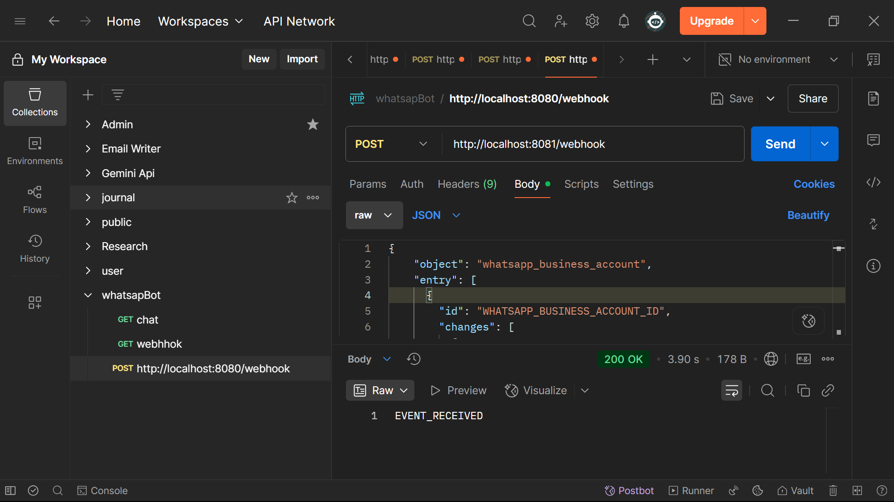

# WhatsApp Chatbot Backend

🚀 A Java + Spring Boot based chatbot backend using Firebase and Gemini API.

## 🔧 Features

- WhatsApp Webhook Receiver (mocked)
- Gemini AI-powered reply generator
- Firebase Firestore integration
- Testable with mock payload
- Ready for Cloud API production

## 🧪 Quick Test

```bash
curl -X POST http://localhost:8081/webhook \
  -H "Content-Type: application/json" \
  -d @mock-whatsapp.json
```

## 📸 ScreenShot


## 📽️ Demo Video
🎬 Watch the project demo on Loom()

## 🙋 About Me
##### Bhargava Sai Abhinay Bondalapati
##### 🎓 B.Tech CSE (AIML), Malla Reddy University
##### 📧 bhargavasaiabhinay.b@gmail.com
##### 📞 +91 7989104567
##### 🔗 LinkedIn(https://www.linkedin.com/in/abhinaybondalapati/)
##### 📂 GitHub Profile(https://github.com/Abhinaytechie)